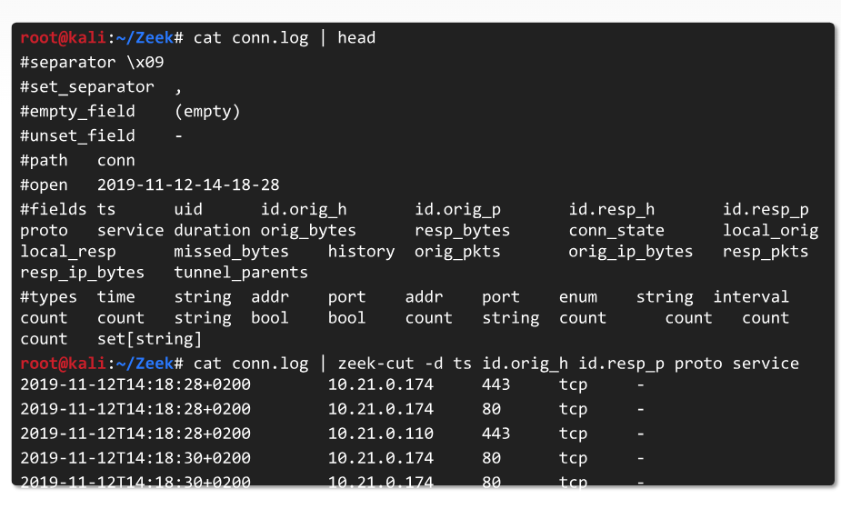

# Network Forensics
## Table of Contents
1. Capturing traffic
2. Proxy servers
3. Analysis methodology
4. Zeek NSM
5. Investigation flow
# Capturing Traffic
## Network Traffic
- A large volume of data is typically transmitted over any network
- Network traffic analysis can reveal lateral movement, C2, and more.
    - Network forensics can be performed only if the network is monitored.
## Traffic Data Sources
- Full Packet Capture = Data captured by network security devices
- Logs = Can be obtained from host and network devices
- Netflow = A network protocol for collecting IP information
## tcpdump
- tcpdump is an efficient tool for network capture
- It is installed by default on most servers and network equipment
- It can be used for live capture or to save .pcap files.
## tcpdump Filters
- Flags and descriptions
- -i [interface] = interface on which to listen
- -c [packets] = packets to capture
- -v = verbose output
- host[host] = host to filter (both src and dst)
- -tcp port [port] = which protocol and port to filter (src and dst)
- and/or = used to create complex rules
## Capture Utilites
- Most firewalls have this ability, like pfsense
- Somenetwork devices have logging and capture functionality
- These options are especially useful in routers
- Packet capture can also be configured to start automatically when triggered.
# Proxy Servers
## Proxy Server Basics
- Proxy servers can be used as protection mechananisms
- theres 2 proxy servers, forward and reverse
- all intent purposes, basically a MITM, generally protecting or disturbuting something
- in some cases, they can cache data for faster service
- they can slo be used to inspect traffic
    - Proxy servers are commonly used to investigate requests from clients
## Burp Proxy
- Burp proxy is a proxy often used for investigations
- It is more widely used in the malware analysis (MA) and penetration testing (PT) fields.
## Fiddler Web Debugger Proxy
- A popular web debugging proxy that can be used to inspect, log, and alter HTTP/HTTPS traffic between a client and a web server.
## Fiddler Proxy
- Fiddler provides insight into headers, cookies, and the cache.
- Fiddler supports traffic recording and playback, request composition and session manipulation
- Fiddler can be used for troubleshooting as well as security and performance testing.
# Analysis Methodology
## IDS Inspection
- The best place to start a network investigation is by inspecting the IDS, intrustion detection system
- IDS rules can help narrow the scope of the investigation
## Tcpreplay
- Used to replay previously captured traffic
- Can replay traffic captured in an environment that does not include an IDS
## Wireshark Statistics
- From a forensics point of view, wireshark can present lots of useless content
- Its best to check some of the statistics presented in Wireshark before starting a thorough investigation of the data
## Useful Wireshark Features
- Display Filter expressions = In wireshark, filters are powerful tools that can be use to enhance searches
- Stream Inspection = Wireshark enables data stream inspection instead of packet-by-packet inspection, which may result in missed data
- Quick export = Depending on the location of the capture, Wireshark can export some objects
## Abnormalities
- Another action that may help an investigation is to search for abnormalities
- An abnormality can be an unusual port or protocol
- Unusually high levels of traffic from hosts may also be suspicious
# Zeek NSM
## Zeek
- A framework used to parse, normalize, and correlate logs
- Zeek can read a .pcap file and extract useful security-realted fields.
## Setting up Zeek
- Zeek can be installed using the default package manager
- Its main module is the zeekcontrol utility
- To start using Zeek, run install and start

## Generating Logs
- While running, zeek will create and save logs in /usr/local/zeek/logs/current
- Zeek can also parse .pcap files by running zeek -r [pcap]

## Zeek-Cut
- Zeek logs have structures based on columns
- Each column can be transferred to Zeek-Cut
- The output can be filtered and searched using pipes

## Isolating DAta
- Pipes can help with performing advanced searches
- Advanced searches in Zeek can quickly identify traffic abnormalities
